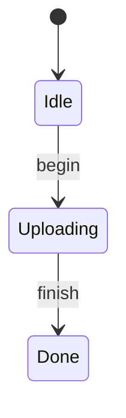

# Debugging

Gust gives you four views of a machine, and they catch different things. The validator catches contradictions in the source. The diagram catches a state graph that does not match the one in your head. The AST dump catches a parse that did not mean what you wrote. Tracing catches a machine that took a path you did not expect at runtime.

This guide is about knowing which one to reach for.

## Always run `gust check` first

```bash
gust check src/machines/upload.gu
```

It parses and validates without generating anything. Exit code is 0 when there are no errors, 1 when there are. Warnings are printed either way and do not fail the command.

::: callout warning "`gust build` does not validate"
This is the single most important thing on this page. `gust build` parses and generates — it does **not** run the validator. Given a source with an undefined state, a `goto` to a state that is not a declared target, and a call to an effect that does not exist, `gust build` exits 0 and writes a `.g.rs` containing `effects.uploud(&path)` against a trait that has no such method.

`gust check` and `gust schema` validate. `gust build` and `gust diagram` do not. Wire `gust check` into your build script or your CI step, not just into your habits.
:::

## Reading a diagnostic

Diagnostics carry a source span, a note explaining the underlying reason, and — where there is one — a concrete fix.

```gust
machine Uploader {
    state Idle
    state Uploading(path: String, attempt: i64)
    state Done(url: String)

    transition begin: Idle -> Uploading
    transition finish: Uploading -> Done

    effect upload(path: String) -> String
    effect audit(path: String) -> ()

    on begin(path: String) {
        goto Uploading(path, 1);
    }

    on finish(ctx: FinishCtx) {
        let trace = perform audit(ctx.path);
        let url = perform upload(ctx.path);
        goto Done(url);
    }
}
```

```text
warning: unused binding 'trace'
  --> src/machines/upload.gu:17:9
   |
16 |     on finish(ctx: FinishCtx) {
17 |         let trace = perform audit(ctx.path);
   |         ^
18 |         let url = perform upload(ctx.path);
   |
   = note: the value is never read; Go codegen rejects unused locals outright
   = help: remove the binding, or call the effect without binding it: `perform ...;` instead of `let trace = perform ...;`

Check passed
```

The `note` is doing real work here. This is not a tidiness complaint — it is telling you that the same source produces Rust that merely warns and Go that will not compile at all. That asymmetry is why the diagnostic fires against the `.gu`: you hear it once, in one place, rather than as a backend-specific surprise later.

Name errors come with a did-you-mean suggestion computed by string similarity:

```gust
machine Uploader {
    state Idle
    state Uploading(path: String)
    state Done(url: String)

    transition begin: Idle -> Uploadng
    transition finish: Uploading -> Done

    effect upload(path: String) -> String

    on begin(path: String) {
        goto Uploading(path);
    }

    on finish(ctx: FinishCtx) {
        let url = perform uploud(ctx.path);
        goto Done(url);
    }
}
```

```text
error: undefined state 'Uploadng' in transition target
  --> src/machines/upload.gu:6:5
   |
 5 |
 6 |     transition begin: Idle -> Uploadng
   |     ^
   |
   = note: declared states: Idle, Uploading, Done
   = help: did you mean 'Uploading'?

error: undeclared effect 'uploud'
  --> src/machines/upload.gu:0:0
   = note: effect is used but never declared in this machine
   = help: did you mean 'upload'?
```

One typo cascades. The same run also reports `unreachable state 'Uploading'` and `unused effect 'upload'` — both are consequences of the misspelling, not separate problems. When a run produces a burst of diagnostics, fix the first name error and re-run before reading the rest.

Note the `:0:0` on the second error. Not every AST node carries a span yet; expression-level nodes fall back to a default. When a diagnostic points at line 0, the message text is all you have to locate it.

## What each warning is protecting you from

| Warning | What it means | What to do |
| --- | --- | --- |
| `unused binding 'x'` | A `let` the handler never reads. Rust warns; Go rejects unused locals outright. | Use the statement form: `perform f();` |
| `unused effect 'f'` | Declared but never performed. Usually a rename that missed a call site. | Delete it, or find the misspelt `perform`. |
| `unreachable state 'S'` | No transition targets it. Usually a typo in a target list. | Check the transition declarations. |
| `transition 't' has no handler` | Declared but no `on t(...)`. The generated method does nothing. | Write the handler. |
| `handler 'h' has code paths that don't end with a goto` | A path falls through without transitioning. **Often a false positive** — see below. | Verify by eye; add the missing `goto` if real. |
| `handler 'h' has inconsistent if/else` | One branch transitions, the other falls through. | Terminate both branches, or neither. |
| `handler parameter 'p' is shadowed by the from-state field of the same name` | The field wins. The parameter is unreachable and becomes a dead argument on the generated method. | Rename the parameter, or drop it and read the field. |
| `non-exhaustive match on enum 'E': missing variant(s) …` | The match does not cover every variant. | Add the arms, or a `_` arm. |
| `binary operator 'op' has incompatible operand types` | Inferred operand types do not match. | Check the types; unknown types skip the check, so this only fires when both are known. |
| `goto 'S' argument N has type T, but field 'f' expects U` | Positional `goto` args do not line up with the target state's fields. | Reorder or fix the argument. |
| `Go cannot represent the error type of effect 'f'` | `Result<_, E>` where `E` is not `String`. Go erases `E` to `error`. | Declare it `Result<_, String>` if Go is a target. |
| `handler 'h' performs N actions in a single sequence` | More than one non-idempotent step on one path. A replay-aware runtime cannot checkpoint it cleanly. | Split across transitions. |
| `handler 'h' has side-effectful steps after an action` | An `action` must be the last externally visible step before the transition. | Move the effects above the action. |

### The false positive worth knowing about

The handler-termination analysis does not descend into `match` arms. A handler whose every arm ends in `goto` still warns:

```text
warning: handler 'deploy' has code paths that don't end with a goto
  --> src/machines/deploy.gu:10:5
   |
10 |     async on deploy(ctx: DeployCtx) {
   |     ^
   |
   = note: all handler paths should transition to a new state
```

The code is correct; the analysis is conservative. Confirm by reading the arms, then move on. Do not add an unreachable `goto` to silence it.

## When `gust check` passes and the backend does not

`gust check` validates the Gust source. It does not promise the generated code compiles, and the two backends are not equivalent. These pass validation cleanly and then fail downstream:

| Construct | Rust | Go |
| --- | --- | --- |
| A misspelt type on a handler's first parameter | parameter silently dropped | parameter silently dropped |
| A machine with a `channel` | compiles | compiles |
| A machine header with a `sends` annotation | compiles — helper is an inherent method | compiles |

The first one is the nastiest, because nothing anywhere reports it. The ctx parameter is identified as the first handler parameter whose type is not a *declared* type, and undeclared type names are legal by design — that is how `ctx: FinishCtx` works. So `on pay(odrer: Order)` reads `odrer` as the ctx accessor and drops it from the generated signature. **If a handler argument vanishes from the generated code, suspect a misspelt type.**

The habit that catches all of these is to compile the output for every backend you ship, and to use `clippy -D warnings` rather than plain `cargo check`, because that is what consumers use:

```bash
gust check src/machines/upload.gu
gust build src/machines/upload.gu --compile
cargo clippy --workspace --all-targets --all-features -- -D warnings

gust build src/machines/upload.gu --target go --package upload -o ./go
cd go && go vet ./...
```

This is the lesson Gust's own test suite learned the hard way: three backends were emitting output that no compiler had ever seen, and two of them did not compile.

## Seeing the state graph

`gust diagram` renders the machine as a Mermaid state diagram. It is the fastest way to check that the graph you declared is the graph you meant:

```bash
gust diagram src/machines/upload.gu
```



The initial state is the first `state` declared. Every arrow comes from a `transition` declaration, one per target, so a transition with three targets draws three arrows. Use `-m <name>` to pick one machine out of a multi-machine file, and `-o <file>` to write instead of printing.

What the diagram shows you that the source does not: an unreachable state stands out immediately, and so does a transition you declared but never wired into the flow. What it will *not* show you is which branch a handler actually takes — the diagram is built from the declarations, not from the handler bodies. A `goto` to a state that is not in the transition's declared target list does not appear here at all; that is what `gust check` is for.

## Seeing what the parser saw

When a construct does not behave the way you expect, dump the AST:

```bash
gust parse src/machines/upload.gu
```

It prints the parsed `Program` as a Rust debug tree — declarations, fields, spans, handler bodies. This is where you go to confirm that `ctx: FinishCtx` really was treated as the ctx accessor, or that a type you wrote parsed as `Simple("i64")` rather than something else.

```text
StateDecl {
    name: "Uploading",
    fields: [
        Field { name: "path", ty: Simple("String") },
        Field { name: "attempt", ty: Simple("i64") },
    ],
    span: Span { start_line: 3, start_col: 5, end_line: 3, end_col: 48 },
},
```

If you want the same information as structured data rather than as a debug dump, use the MCP server's `gust_parse` tool instead — it returns the AST as JSON, including the `kind` field that distinguishes an `effect` from an `action`. See [Workflow Runtime Integration](workflow_runtime.md#the-gust_parse-mcp-contract) for the full contract.

## Instrumenting a running machine

`--tracing` emits `tracing` events for every transition and every effect invocation, all guarded behind a feature flag:

```bash
gust build src/machines/upload.gu --tracing
```

```rust
pub fn finish(&mut self, effects: &impl UploaderEffects) -> Result<(), UploaderError> {
    match &self.state {
        UploaderState::Uploading { path, attempt: _attempt } => {
            let path = path.clone();
            #[cfg(feature = "tracing")]
            let __tracing_span = tracing::info_span!("finish", machine = "Uploader", from = "Uploading", to = "Done");
            #[cfg(feature = "tracing")]
            let __tracing_guard = __tracing_span.enter();
            #[cfg(feature = "tracing")]
            tracing::info!(machine = "Uploader", transition = "finish", from = "Uploading", to = "Done", "state transition");
            #[cfg(feature = "tracing")]
            tracing::info!(effect = "audit", "effect invocation");
            let _ = effects.audit(&path);
            // ...
```

Every emitted line is behind `#[cfg(feature = "tracing")]`, so with the feature off there is no code at all — you can leave `--tracing` on permanently in your build pipeline and turn the instrumentation on only when you need it. To use it, your crate needs a `tracing` feature that enables the `tracing` dependency, and a subscriber installed at startup.

In a manifest, set it per target:

```toml
[targets.rust]
output = "src/generated"
tracing = true
```

The events are structured fields, not formatted strings, so you can filter on `machine`, `transition`, `from`, `to`, and `effect` in whatever subscriber you use.

## In the editor

`gust-lsp` is a language server built on tower-lsp. Point your editor at the `gust-lsp` binary for `.gu` files and you get:

- **Diagnostics** — the same validator output as `gust check`, live as you type. This is the highest-value feature, because it moves the "check passed but the backend rejected it" feedback loop into the editor.
- **Hover** and **go-to-definition** for states, transitions, and effects.
- **Completion**, triggered on space and `:`.
- **Signature help**, triggered on `(` and `,`.
- **Document symbols** — the outline view.
- **Code actions** — generating a stub for a transition with no handler.
- **Inlay hints**.
- **Formatting** — the same transformation as `gust fmt`.

**Rename and find-references are deliberately disabled.** Symbol resolution is not yet scope-aware, so both would produce wrong results on any file with shadowed names. They are not missing by oversight.

## Checking the environment

When something works on your machine and not on someone else's:

```bash
gust doctor
```

```text
Gust Doctor
===========

  [OK] Rust: rustc 1.96.1
  [OK] Cargo: cargo 1.96.1
  [OK] Go: go version go1.26.4 (optional)
  [OK] Gust: 0.4.0

Project: /path/to/project
  Cargo.toml: found
  gust-build dependency: found

.gu files: 3 found
  [WARN] src/processor.gu -> processor.g.rs (stale, regenerate)
  [OK] src/order.gu -> order.g.rs (up to date)
```

It reports toolchain versions, project layout, whether each `.gu` has a generated file, and whether that file is stale. It also validates every `.gu` it finds, which makes it a reasonable whole-project `gust check`.

::: callout warning "Staleness is decided by modification time"
`gust doctor` and `gust-build` both compare mtimes. After a fresh clone every file shares one checkout timestamp, so a genuinely stale generated file reports as up to date and `gust-build` will not rewrite it. If you commit generated output, guard it with `gust generate --check` in CI rather than relying on mtime.
:::

## Where to go next

- [Migrating from Rust](migration_rust.md) — if the thing you are debugging is a construct Gust does not have.
- [Performance](performance.md) — what the generated code actually does, if the problem is speed rather than correctness.
- [Errors](../reference/errors.md) — the generated error types and what each variant means.
