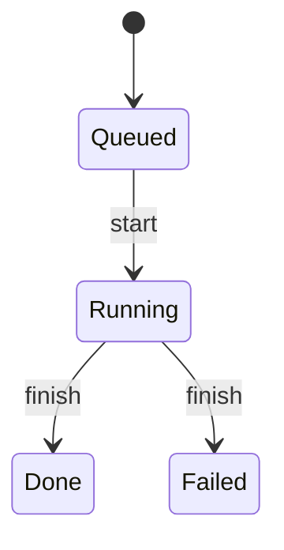

# States and Transitions

A machine is a set of states, a set of legal moves between them, and a handler
per move. This page covers the first two and the `goto` statement that performs
the move.

## States

```gust
machine Job {
    state Queued
    state Running(worker: String, attempt: i64)
    state Done(result: String)

    transition start: Queued -> Running
    transition finish: Running -> Done

    on start(worker: String) {
        goto Running(worker, 1);
    }

    on finish(ctx: FinishCtx) {
        goto Done(ctx.worker);
    }
}
```

A state optionally carries fields. Fields are ordered and typed, and become named
fields of a struct variant in Rust and of a per-state data struct in Go.

State names must be unique within a machine; a duplicate is a hard error.

### The first state is the initial state

The **first `state` declared in the machine body** is the initial state. Nothing
else marks it, and reordering the declarations changes the machine's behavior.

The constructor is derived from it:

| Initial state | Rust | Go |
|---|---|---|
| `state Queued` (no fields) | `Job::new()`, plus a `Default` impl | `NewJob()` |
| `state Queued(id: String)` | `Job::new(id: String)` | `NewJob(id string)` |

When the initial state has fields there is no meaningful default, so no `Default`
impl is emitted.

### Unreachable states

The validator counts incoming transitions for every state, ignoring the initial
one, and warns about any state nothing leads to:

```
warning: unreachable state 'Cancelled'
   = note: no transitions lead to this state
```

This is a warning, not an error — a state space can legitimately be built up
before the transitions that reach it.

## Transitions

```
transition start: Idle -> Running
transition finish: Running -> Done | Failed
transition run: Idle -> Done timeout 5s
```

A transition names exactly one source state and one or more `|`-separated
targets. Both sides are checked against declared state names, with a
did-you-mean suggestion when a name is close to a real one. Transition names must
be unique within a machine.

Each transition becomes one method on the generated machine — `start(...)` in
Rust, `Start(...)` in Go — that returns an error when called from any state other
than the declared source. See [Lifecycle](lifecycle.md#transition-methods) for
the full signature rules.

### Transitions with no handler

A transition without a matching `on` handler is legal and produces a warning:

```
warning: transition 'begin' has no handler
   = note: add an 'on begin(...)' handler for this transition
```

Codegen falls back to moving to the transition's *first* declared target. If that
target has fields there is nothing to populate them with, so the Rust backend
emits a comment instead of an assignment and the machine's state does not change.
Treat the warning as an error in practice.

### Timeouts {#timeouts}

```
transition run: Idle -> Done timeout 5s
```

Units are `ms`, `s`, `m`, and `h`.

The semantics are narrower than they look. A timeout bounds **how long the
handler body may run**, not how long the machine may sit in a state.

- **Rust** wraps the handler body in `tokio::time::timeout` and, on expiry,
  returns `Err(<Machine>Error::Failed { reason: "transition '<name>' timed out
  after ..." })`. The state is left unchanged.
- **Go** creates a `context.WithTimeout` and checks it after the body has run,
  returning a `*<Machine>Error` carrying the same message.

Declaring a timeout makes the generated transition method `async` in Rust and
gives it a leading `ctx context.Context` parameter in Go, whether or not the
handler is `async`.

To model elapsed time in a state — "fail if nobody confirms within an hour" —
carry a timestamp in the state's fields and compare it in an effect.

## `goto` {#goto}

`goto` moves the machine to a target state. Arguments are zipped **positionally**
against the target state's declared fields.

```gust
machine Pipeline {
    state Running(step: String, remaining: i64)
    state Done(step: String)

    transition advance: Running -> Running | Done

    on advance(ctx: AdvanceCtx, next_step: String) {
        if ctx.remaining > 0 {
            goto Running(next_step, ctx.remaining - 1);
        } else {
            goto Done(ctx.step);
        }
    }
}
```

`goto Running(next_step, ctx.remaining - 1)` assigns `step = next_step` and
`remaining = ctx.remaining - 1`. Names do not participate; only order does.

Parentheses are optional when the target has no fields: `goto Done;` and
`goto Done();` are the same.

Three checks run over every `goto`:

| Check | Severity | Message |
|---|---|---|
| Argument count matches the target's field count | error | `goto 'X' expects N argument(s) but got M` |
| Argument types match the field types, when inferable | error | `goto 'X' argument N has type A, but field 'f' expects B` |
| The target is one of the transition's declared targets | error | `goto target 'X' is not a declared target of transition 't'` |

The type check runs only when the arity check passes, and only for arguments
whose type can be inferred. See [Types](types.md#what-the-validator-checks).

### `goto` ends the handler {#goto-does-not-return}

`goto` assigns the new state and returns. Nothing after it in the handler runs,
so an early `goto` is a normal way to leave a handler:

```gust
machine Counter {
    state Counting(index: i64, limit: i64)
    state Finished(total: i64)

    transition tick: Counting -> Counting | Finished

    on tick(ctx: TickCtx) {
        if ctx.index >= ctx.limit {
            goto Finished(ctx.index);
        } else {
            goto Counting(ctx.index + 1, ctx.limit);
        }
    }
}
```

The same handler written with an early `goto` and no `else` behaves identically —
the first `goto` returns, so the trailing one is only reached when the condition
is false:

```gust
machine EarlyCounter {
    state Counting(index: i64, limit: i64)
    state Finished(total: i64)

    transition tick: Counting -> Counting | Finished

    on tick(ctx: TickCtx) {
        if ctx.index >= ctx.limit {
            goto Finished(ctx.index);
        }
        goto Counting(ctx.index + 1, ctx.limit);
    }
}
```

Both styles are fine; pick whichever reads better. `gust-stdlib` uses the early
form throughout.

::: callout note "Changed after 0.3.0"
In 0.3.0 and earlier `goto` emitted a bare state assignment with no return, so
the early form *fell through*: the handler assigned `Finished`, kept running,
and overwrote it with `Counting`. The machine ended in the wrong state with no
diagnostic anywhere, and in Rust the output usually failed to compile as well
(`error[E0382]: borrow of moved value`) because the abandoned `goto` had already
moved a non-`Copy` field. If you are on 0.3.0, write `if`/`else` and keep every
path disjoint.
:::

### Modelling iteration

There is no loop construct. Iterate with a self-transition that carries the
index, and re-invoke the transition method from the host until the machine leaves
the state — the `Counter` machine above is the canonical shape. The comparison
and the work per step go through effects; see
[the effect escape hatch](effects_handlers.md#the-effect-escape-hatch).

## Diagrams

`gust diagram <file>` renders the state space as a Mermaid `stateDiagram-v2`,
with `[*]` pointing at the initial state and one edge per transition target:



Pass `--machine <Name>` to restrict the output to one machine in a multi-machine
file.

## Next

- [Effects and Handlers](effects_handlers.md) — writing the `on` handler that
  runs during a transition
- [Lifecycle](lifecycle.md) — the generated transition method signature
- [Errors](errors.md) — the full diagnostic list
