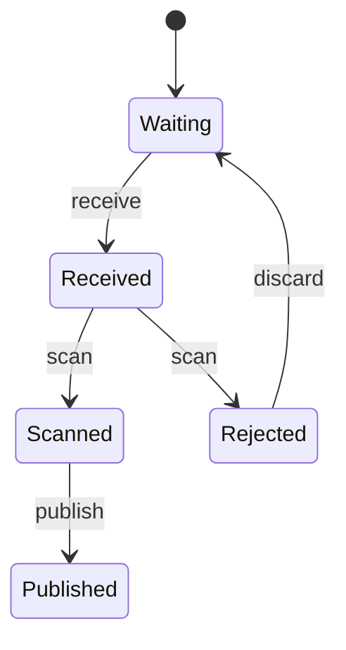

# Your First Machine

The machine from [Getting Started](./getting_started.md) accepts a photo and stops. On this page you give it the rest of its life: a photo is received, scanned, then either published or rejected, and a rejected photo can be discarded so the machine is free again.

Still no side effects — that is the [next page](./adding_effects.md). Everything here is states, transitions, and branching.

## The lifecycle

Replace the whole of `src/upload.gu` with this.

```gust
type Photo {
    id: String,
    bytes: i64,
}

machine Upload {
    state Waiting
    state Received(photo: Photo)
    state Scanned(photo: Photo)
    state Published(photo: Photo, url: String)
    state Rejected(photo: Photo, reason: String)

    transition receive: Waiting -> Received
    transition scan: Received -> Scanned | Rejected
    transition publish: Scanned -> Published
    transition discard: Rejected -> Waiting

    on receive(photo: Photo) {
        goto Received(photo);
    }

    on scan(ctx) {
        if ctx.photo.bytes > 8000000 {
            goto Rejected(ctx.photo, "larger than the 8 MB limit");
        } else {
            goto Scanned(ctx.photo);
        }
    }

    on publish(ctx, url: String) {
        goto Published(ctx.photo, url);
    }

    on discard() {
        goto Waiting;
    }
}
```

Three things are new.

**A transition can have several targets.** `scan: Received -> Scanned | Rejected` says the scan either passes or fails, and the handler decides which. Declaring every outcome is what lets the compiler check that each `goto` in the handler is a legal destination — misspell `Scannned` and `gust check` tells you so.

**States carry the data that state needs.** `Published` carries a URL because a published photo has one; `Waiting` carries nothing because a waiting machine knows nothing. There is no ambient context in Gust, so anything a later state needs must be passed forward in the `goto`. Arguments are matched to the target state's fields by position, in declaration order.

**Handlers can read the state they are leaving.** That is what `ctx` is for.

## The `ctx` parameter

`on scan(ctx)` reads `ctx.photo` — the `photo` field of `Received`, the state `scan` starts from.

`ScanCtx` is not a type you declare anywhere, and it never appears in the generated code. Gust treats the first handler parameter whose type is not a declared type as the accessor for the source state's fields, and removes it from the generated method signature. Every other parameter becomes a real argument: `on publish(ctx, url: String)` generates a method taking only `url`.

The convention is `{Transition}Ctx` — `ScanCtx`, `PublishCtx` — and you leave it undeclared on purpose.

::: callout warning "A typo in a parameter type silently eats the parameter"
Because undeclared type names are legal, `on publish(ctx, url: Strng)` makes `url` the ctx accessor and drops it from the signature. `gust check` reports `Check passed`. If a handler argument mysteriously vanishes from the generated code, look at the spelling of its type first.
:::

## Give every branch a `goto`

`goto` sets the state and returns. Nothing after it in the handler runs, so an `if` without an `else` is fine: the early `goto` leaves, and the code below it is reached only when the branch was not taken. (On 0.3.0 this was not true — `goto` fell through — so on the published release, terminate both branches explicitly.)

So cover the branches:

```gust
type Photo {
    id: String,
    bytes: i64,
}

machine SizeCheck {
    state Received(photo: Photo)
    state Scanned(photo: Photo)
    state Rejected(photo: Photo, reason: String)

    transition scan: Received -> Scanned | Rejected

    on scan(ctx) {
        if ctx.photo.bytes > 8000000 {
            goto Rejected(ctx.photo, "larger than the 8 MB limit");
        } else {
            goto Scanned(ctx.photo);
        }
    }
}
```

Every path through a handler should end in a `goto`, and each `goto` should be the last thing on its path.

## See the graph

The compiler will draw the state machine for you:

```bash
gust diagram src/upload.gu
```

```text
stateDiagram-v2
    [*] --> Waiting
    Waiting --> Received : receive
    Received --> Scanned : scan
    Received --> Rejected : scan
    Scanned --> Published : publish
    Rejected --> Waiting : discard
```

That is Mermaid, so it renders directly in any Markdown that supports diagrams:



Look at what the diagram does not contain. There is no arrow from `Received` to `Published`. That absence is the whole design: you cannot publish a photo that has not been scanned, because no such transition exists.

## Drive it

Regenerate and update `src/main.rs`.

```bash
gust check src/upload.gu
gust build src/upload.gu
```

```rust "src/main.rs"
include!("upload.g.rs");

fn main() {
    let mut upload = Upload::new();

    upload
        .receive(Photo {
            id: "img-0001".to_string(),
            bytes: 248_000,
        })
        .expect("receive is legal from Waiting");
    upload.scan().expect("scan is legal from Received");
    upload
        .publish("https://cdn.example.com/img-0001.jpg".to_string())
        .expect("publish is legal from Scanned");

    println!("published: {:?}", upload.state());

    // The size branch: an oversize photo lands in Rejected instead.
    let mut oversize = Upload::new();
    oversize
        .receive(Photo {
            id: "img-0002".to_string(),
            bytes: 12_000_000,
        })
        .unwrap();
    oversize.scan().unwrap();
    println!("oversize: {:?}", oversize.state());

    // The illegal move: publish is only reachable from Scanned.
    let mut skipper = Upload::new();
    skipper
        .receive(Photo {
            id: "img-0003".to_string(),
            bytes: 1_000,
        })
        .unwrap();
    let err = skipper
        .publish("https://cdn.example.com/img-0003.jpg".to_string())
        .expect_err("publish from Received must fail");
    println!("blocked: {err}");
}
```

```bash
cargo run
```

```text
published: Published { photo: Photo { id: "img-0001", bytes: 248000 }, url: "https://cdn.example.com/img-0001.jpg" }
oversize: Rejected { photo: Photo { id: "img-0002", bytes: 12000000 }, reason: "larger than the 8 MB limit" }
blocked: invalid transition 'publish' from state 'Received { photo: Photo { id: "img-0003", bytes: 1000 } }'
```

Two things are worth noticing in that `main`. `scan()` takes no arguments even though it reads `ctx.photo`, because the ctx parameter never reaches the generated signature. And `publish` takes exactly one argument, the `url: String`, for the same reason.

Right now the scan only checks a file size, which is not much of a scan. Next you connect it to something real: [Adding Effects](./adding_effects.md).
