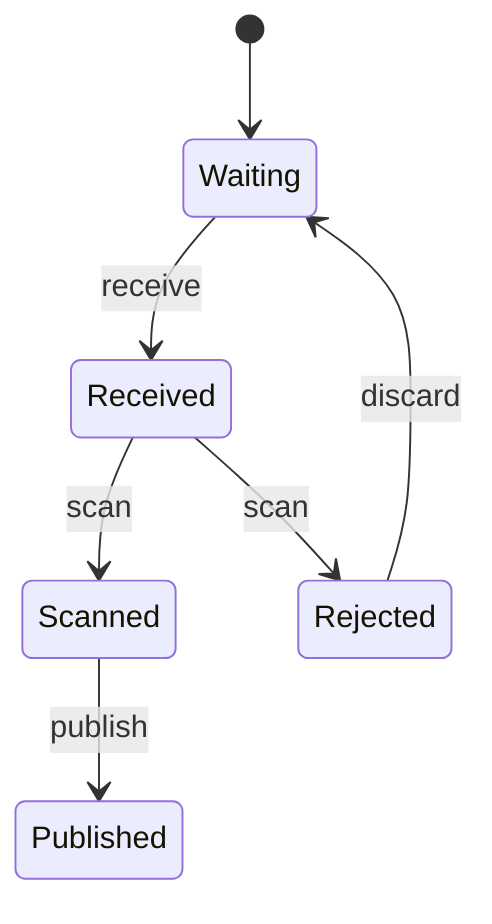

# Tutorial

You are going to build a photo upload pipeline.

It starts as a machine with two states and ends as a supervised worker that scans uploads, stores them on a CDN, emails the uploader, and refuses to publish anything it has not scanned. Every page adds one capability to the same file, so by the end you have one program rather than eight disconnected snippets.

Here is the machine you finish with:

## What you need

- **Rust 1.75 or newer**, with `cargo` on your path. Everything here was checked against 1.96.
- **A terminal**, and about an hour if you type rather than paste.
- **No prior Gust.** You need to be able to read Rust, but the Gust language itself is introduced from scratch.

Go is optional. The pipeline you build compiles to Go as well as Rust, and [Deployment](./deployment.md) shows you how, but you can finish the tutorial without a Go toolchain installed.

## The route

::: steps

1. **[Getting Started](./getting_started.md)**
   Install the compiler, write a two-state machine, and run it from a Rust binary.

2. **[Your First Machine](./first_machine.md)**
   Grow the state graph to the full upload lifecycle and watch the machine reject illegal transitions.

3. **[Adding Effects](./adding_effects.md)**
   Declare the side effects — virus scanning, CDN storage, notification email — and implement them in Rust.

4. **[Testing](./testing.md)**
   Swap in a second, deterministic implementation of the effects and test every branch without touching the network.

5. **[Going Async](./async.md)**
   Make the CDN upload `async` and drive the machine from Tokio.

6. **[Supervision](./supervision.md)**
   Feed uploads over a channel and put a supervisor in front of the worker.

7. **[Deployment](./deployment.md)**
   Decide whether to generate code during `cargo build` or commit it, and wire the choice into CI.

:::

Each page ends with a working program. If a page leaves you stuck, the previous page's result still runs — nothing here depends on you having got the next step right.

## What Gust is for

Gust is a small language for describing state machines. You write states, the transitions between them, and the side effects a transition needs; the compiler generates a Rust or Go implementation with a state enum, one method per transition, and a trait for the effects.

The point is that illegal sequences stop being your problem. You cannot publish a photo that has not been scanned, because there is no code path that does it — the generated `publish` method returns an error from every state except `Scanned`. You will watch that happen two pages from now.

Start with [Getting Started](./getting_started.md).
