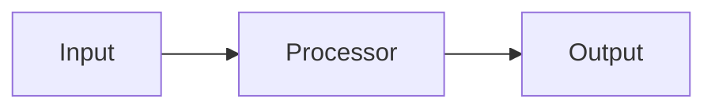

# Event Processor Example


```mermaid
flowchart LR
  Input --> Processor
  Processor --> Output
```

## Build

```bash
cargo test
cargo run
```

`processor.gu` demonstrates event-driven state advancement.
