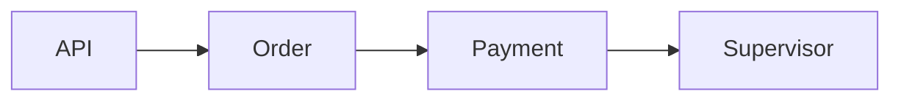

# Microservice Example


```mermaid
flowchart LR
  API --> Order
  Order --> Payment
  Payment --> Supervisor
```

## Build

```bash
cargo test
cargo run
```

The included `.gu` files model the core state-machine boundaries.
