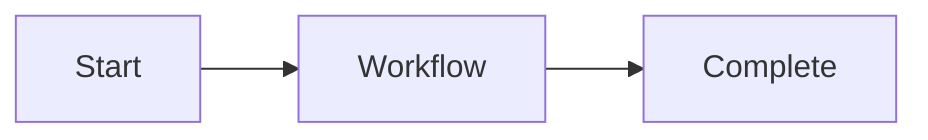

# Workflow Engine Example


```mermaid
flowchart LR
  Start --> Workflow
  Workflow --> Complete
```

## Build

```bash
cargo test
cargo run
```

`workflow.gu` captures a simple completion lifecycle.
